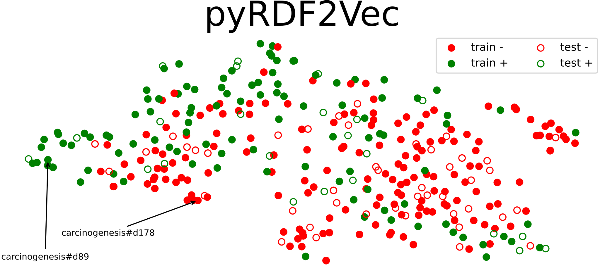

Preview
=======

|image1|

.. raw:: html

      

          
          
      

      

          
           
           
          
      

      
Python implementation and extension of <a
      href="http://rdf2vec.org/">RDF2Vec</a> <b>to create a 2D feature matrix
      from a knowledge graph</b> for downstream ML tasks.

.. toctree::
   :maxdepth: 2
   :caption: Documentation

   readme
   glossary
   license
   posts-papers
   API <api/pyrdf2vec>

.. toctree::
   :maxdepth: 2
   :caption: Contributions

   contributing
   code_of_conduct
